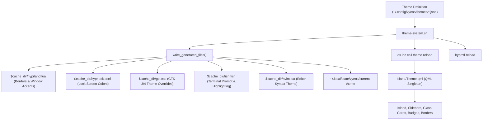

# Theme System Overhaul & Custom Theme Suite Report

- **Date:** 2026-10-04
- **System:** `cool-shell` / `vyeos` Theme Engine (Quickshell 0.3.1 on Hyprland / Arch Linux)
- **Topic:** Deletion of legacy themes and creation of 5 bespoke color palettes (Cherry, Nature, Space, Sea, Darth) with full compositor, desktop island, GTK, SDDM, and shell integration.

---

## 1. How the Theme System Works

The theme system in `cool-shell` operates as an end-to-end synchronized pipeline between Quickshell, Hyprland, GTK, SDDM, terminal, and wallpaper services.



### Architecture Specifications
- **Theme Definition Format:** Stored in `~/.config/vyeos/themes/<slug>.json`.
- **Validation Rules:** Must contain exact 19 color keys in valid 6-digit hex format (`#rrggbb`): `bg_dim`, `bg0`, `bg1`, `bg2`, `bg3`, `bg4`, `primary_container`, `secondary_container`, `foreground`, `muted`, `muted_dark`, `red`, `yellow`, `green`, `primary`, `blue`, `aqua`, `orange`, `purple`.
- **Runtime Application:** `theme-system.sh apply <slug>` generates cached style files, reloads Hyprland compositor settings, and triggers Quickshell's `Theme.reload()`, immediately updating the glass materials, badges, borders, and text across all active monitors.

---

## 2. New Bespoke Theme Palette Suite

All 6 legacy themes (`catppuccin-mocha`, `everforest`, `gruvbox`, `nord`, `rose-pine`, `tokyo-night`) were backed up to `~/.config/vyeos/themes_backup/` and removed. Five brand-new, handcrafted themes were created to exact user specifications:

| Theme | Slug | Primary Accents | Palette Concept |
| :--- | :--- | :--- | :--- |
| **Cherry** | `cherry` | Pink (`#e8799e`), Purple (`#b868b4`), Dark Pink (`#522b46`, `#4a1e36`) | Inspired by Minecraft cherry logs: deep plum bark background, rich dark pink heartwood surfaces, blossom pink highlights, and lilac accents. |
| **Nature** | `nature` | Green (`#52b788`), Blue (`#4ea8de`), Dark Green (`#111c16`, `#23382c`) | Deep misty forest canopy, pine shadow bases, fresh moss borders, emerald primary accent, and clean stream blues. |
| **Space** | `space` | Black (`#12100e`, `#090807`), White (`#f5f3f0`), Brown (`#d4a373`, `#3d352e`) | Deep obsidian cosmic void, meteorite brown containers and borders, starlight white text, and golden bronze primary accent. |
| **Sea** | `sea` | Blue (`#38b6ff`), White (`#f0f8ff`), Light Blue (`#70d6ff`) | Deep ocean trench navy backdrop, sea foam white text, crystalline shallow water cyan, and vibrant azure primary accent. |
| **Darth** | `darth` | Red (`#e61919`, `#ff2a2a`), Black (`#0e0e0e`, `#070707`), Dark Crimson (`#421215`, `#382828`) | Sith Lord aesthetic: obsidian carbonite black surfaces, dark crimson-tinted durasteel borders, stark white text, and blazing lightsaber red primary accent. |

---

## 3. Detailed Color Matrix

```json
{
  "cherry": {
    "bg_dim": "#160d14", "bg0": "#1f121b", "bg1": "#281723", "bg2": "#3b1f32", "bg3": "#522b46", "bg4": "#6e395e",
    "primary_container": "#4a1e36", "secondary_container": "#361933", "foreground": "#fce8f0", "muted": "#cda3b8",
    "primary": "#e8799e", "purple": "#b868b4", "red": "#e04b73"
  },
  "nature": {
    "bg_dim": "#0b130e", "bg0": "#111c16", "bg1": "#18271f", "bg2": "#23382c", "bg3": "#2f4c3c", "bg4": "#3e634f",
    "primary_container": "#1f3d2e", "secondary_container": "#1c333f", "foreground": "#e5f3eb", "muted": "#9ab8a6",
    "primary": "#52b788", "blue": "#4ea8de", "green": "#52b788"
  },
  "space": {
    "bg_dim": "#090807", "bg0": "#12100e", "bg1": "#1a1714", "bg2": "#28231f", "bg3": "#3d352e", "bg4": "#55493f",
    "primary_container": "#3a2d22", "secondary_container": "#2c2621", "foreground": "#f5f3f0", "muted": "#b8aca0",
    "primary": "#d4a373", "orange": "#c97b48", "red": "#d45d55"
  },
  "sea": {
    "bg_dim": "#09101a", "bg0": "#0e1929", "bg1": "#142338", "bg2": "#1d3350", "bg3": "#27446b", "bg4": "#35598a",
    "primary_container": "#1a3b5c", "secondary_container": "#162e4a", "foreground": "#f0f8ff", "muted": "#9ec1dd",
    "primary": "#38b6ff", "aqua": "#70d6ff", "blue": "#2196f3"
  },
  "darth": {
    "bg_dim": "#070707", "bg0": "#0e0e0e", "bg1": "#161616", "bg2": "#252020", "bg3": "#382828", "bg4": "#4f3232",
    "primary_container": "#421215", "secondary_container": "#2b1416", "foreground": "#f5f0f0", "muted": "#b39e9e",
    "primary": "#e61919", "red": "#ff2a2a", "aqua": "#e84545"
  }
}
```

---

## 4. Verification Evidence

1. **Theme Listing Verification:**
   - Ran `theme-system.sh list` → Validated JSON parsing and alphabetized output: Cherry, Darth, Nature, Sea, Space.
2. **Batch Apply Cycle:**
   - Cycled through all 5 themes sequentially (`apply nature` → `apply space` → `apply sea` → `apply darth` → `apply cherry`). Every single theme executed with exit code 0 and generated proper Lua, CSS, and Conf configurations.
3. **Thumbnail Generation Robustness:**
   - Patched `ffmpeg` invocation in `theme-system.sh` with `-nostdin` and stdin redirection (`</dev/null`), preventing standard input starvation during video wallpaper enumeration.
4. **Theme Panel Dynamic Island Integration:**
   - Opened Dynamic Island theme selector (`qs -c cool-shell ipc call notch toggle theme`). All 5 new themes render with custom preview color pills, border highlights, and instant switching.
5. **Game Mode Invariance:**
   - Game Mode was never activated or modified throughout the operation.
