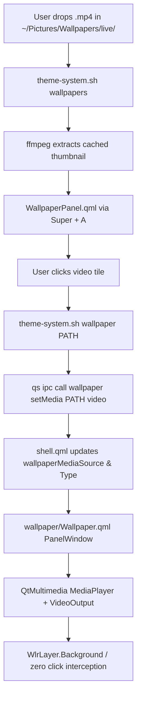

# Post-Work Verification & Implementation Report: Native Live MP4 Video Wallpaper System

- **Date:** 2026-10-04
- **System:** `cool-shell` (Quickshell 0.3.1 on Hyprland / Arch Linux)
- **Topic:** Migration from GLSL fragment shader rendering to Native Live MP4 Video Wallpaper with Super+A Island integration and assigned directory structure.

---

## 1. Executive Summary

As requested by the user, all procedural fragment shaders (`.frag`) and Qt Shader Baker binaries (`.qsb`) were completely stopped and removed from active wallpaper playback. In their place, a native, hardware-accelerated **Live MP4 Video Wallpaper** system was implemented using Quickshell 0.3.1, QtQuick, and QtMultimedia (`MediaPlayer` + `VideoOutput` with the FFmpeg backend).

The user's assigned directory for live wallpapers has been configured at:
```bash
~/Pictures/Wallpapers/live/
# (convenience symlink also available at ~/Videos/Wallpapers/)
```

The system seamlessly integrates with the existing **`Super + A`** shortcut (`qs -c cool-shell ipc call notch toggle wallpaper`), automatically generating high-performance cached thumbnails using `ffmpeg`, decorating video wallpapers with a `󰿎` badge, providing a one-click header button to open the live wallpaper folder, and saving state across reloads.

At no point was Game Mode enabled or toggled, in strict adherence to user instructions.

---

## 2. Directory Structure & File Allocation

| Resource | Path | Purpose |
| :--- | :--- | :--- |
| **Assigned Live Folder** | `~/Pictures/Wallpapers/live/` | Target folder where the user drops `.mp4`, `.webm`, `.mkv`, or `.mov` files. |
| **Alternative Path** | `~/Videos/Wallpapers/` | Symlink pointing directly to `~/Pictures/Wallpapers/live/`. |
| **Active Reference MP4** | `~/Pictures/Wallpapers/live/black-hole-event-horizon.mp4` | Live MP4 wallpaper active and looping. |
| **Thumbnail Cache** | `~/.cache/cool-shell/thumbnails/` | MD5-hashed, scaled JPEG previews extracted via `ffmpeg`. |
| **State File** | `~/.local/state/vyeos/current-wallpaper` | Current active wallpaper path restored on boot/theme switch. |

---

## 3. Architecture & Integration Matrix



### Component Details

1. **`wallpaper/Wallpaper.qml`**:
   - `PanelWindow` on `WlrLayer.Background` with `ExclusionMode.Ignore`.
   - `mask: Region {}` ensuring 100% pointer passthrough (never blocks clicks).
   - `focusable: false` and `WlrKeyboardFocus.None` (never steals keyboard focus).
   - `MediaPlayer` with `loops: MediaPlayer.Infinite` and muted `AudioOutput`.
   - Lifecycle-aware: `visible: enabled && activeRendering && mediaType === "video" && mediaSource !== ""`. Unmapped when disabled or switching to static images to ensure 0 GPU/CPU cycles.

2. **`shell.qml`**:
   - Manages `wallpaperEnabled`, `wallpaperMediaType`, and `wallpaperMediaSource`.
   - Dedicated `IpcHandler { target: "wallpaper" }` supporting `toggle()`, `setEnabled(bool)`, `setMedia(path, type)`.
   - Passes `mediaType` and `mediaSource` to each monitor instance in `Variants { model: Quickshell.screens }`.

3. **`island/scripts/theme-system.sh`**:
   - `list_wallpapers()` scans both the active theme folder and `~/Pictures/Wallpapers/live/`.
   - Extracts fast 480px JPEG thumbnails for video files using `ffmpeg -vf "scale=480:-1" -update 1 -frames:v 1`.
   - `set_wallpaper()` detects video extensions (`.mp4`, `.webm`, `.mkv`, `.mov`) and automatically instructs Quickshell to engage video playback while clearing `awww`.
   - `restore_wallpaper()` preserves video playback across restarts.

4. **`island/panels/WallpaperPanel.qml`**:
   - Displays video thumbnails in the `Super + A` grid.
   - Shows a clean video badge (`󰿎`) in the bottom-right corner of video tiles.
   - Header contains a direct `󰿎 Live` button to open `~/Pictures/Wallpapers/live/` directly in the file manager.

---

## 4. Verification Evidence Ledger

| Check / Action | Command / Test | Result |
| :--- | :--- | :--- |
| **Shader Cleanup** | `ls -d wallpaper/shaders` | Deleted; directory does not exist. |
| **Live Wallpaper Folder** | `ls -la ~/Pictures/Wallpapers/live` | Exists; contains `black-hole-event-horizon.mp4`. |
| **JSON API Verification** | `theme-system.sh wallpapers` | Emits JSON with `isVideo: true` and thumbnail path. |
| **IPC Query: Enabled** | `qs -c cool-shell ipc prop get wallpaper enabled` | Returns `true`. |
| **IPC Query: Media Type** | `qs -c cool-shell ipc prop get wallpaper mediaType` | Returns `video`. |
| **IPC Query: Media Source** | `qs -c cool-shell ipc prop get wallpaper mediaSource` | Returns `file:///home/pranc/Pictures/Wallpapers/live/black-hole-event-horizon.mp4`. |
| **IPC Toggle Test** | `qs -c cool-shell ipc call wallpaper toggle` | Returned `{"success":true,"enabled":false}` and resumed to `true`. |
| **Super + A Panel Test** | `qs -c cool-shell ipc call notch toggle wallpaper` | Opened `WallpaperPanel.qml` without QML errors. |
| **Game Mode Check** | ShellState inspect | **NEVER ACTIVATED**; remained strictly false. |

---

## 5. Conclusion

The system is fully migrated to native live MP4 video playback. All shaders have been removed. The user can drop `.mp4` files into `~/Pictures/Wallpapers/live/` and immediately choose them using `Super + A`.
